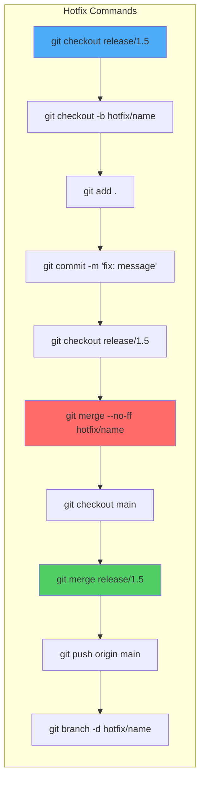
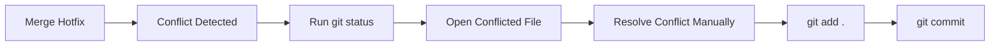
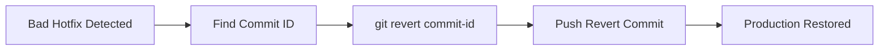

# ART Hotfix Workflow Agent Guide

## Purpose

This file acts as an operational guide for:
- developers
- AI agents

The goal is to help understand:
- repository structure
- Git flow
- hotfix workflow
- release synchronization
- merge strategy
- rollback strategy
- recovery workflows
- conflict handling

The AI agent should use this file to determine:
- which Git commands to run
- which branch strategy to follow
- how to safely recover from failures
- how to continue hotfix workflows

---

# Repository Structure

```text
Workbench-Hotfix-Demo/
│
├── ART/
│   ├── Airtel/
│   │   └── README.md
│   │
│   ├── Reliance/
│   │   └── README.md
│   │
│   └── Tata/
│       └── README.md
│
├── docs/
│   ├── AGENTS.md
│   ├── hotfix-conflicts.md
│   └── implementation.md
│
└── README.md
```

---

# Repository Purpose

This repository simulates enterprise-style hotfix workflows for:

- Airtel
- Reliance
- Tata

The project is used for understanding:
- release branch workflows
- hotfix isolation
- merge conflicts
- cherry-pick flows
- rollback handling
- release synchronization
- production-safe Git workflows

---

# Branch Strategy

## Main Branch

```text
main
```

Purpose:
- stable code
- future development
- shared repository updates

---

## Release Branch

```text
release/1.5
```

Purpose:
- production release
- customer deployment branch
- hotfix integration branch

---

## Hotfix Branch Naming

Format:

```text
hotfix/<release-version>-<ticket>
```

Examples:

```text
hotfix/1.5-AIRTEL-101
hotfix/1.5-BUG-201
hotfix/1.5-BUG-202
```

---

# Hotfix Workflow Rules

## Rule 1

Always create hotfix branches from release branch.

Correct:

```bash
git checkout release/1.5
git checkout -b hotfix/1.5-AIRTEL-101
```

Incorrect:

```bash
git checkout main
git checkout -b hotfix/1.5-AIRTEL-101
```

---

## Rule 2

Never directly commit to:
- main
- release branches

Always use hotfix branches.

---

## Rule 3

After hotfix completion:
1. merge hotfix into release branch
2. sync required changes into main

---

## Rule 4

Customer-specific changes should remain isolated whenever possible.

---

# Standard Hotfix Flow


---

# Hotfix Commands Flow



---

# Merge Strategy

Preferred merge:

```bash
git merge --no-ff hotfix/name
```

Reason:
- preserves hotfix history
- easier rollback
- easier production tracking

---

# Squash Merge Strategy

## When to Use

Use squash merge when:
- hotfix branch contains many small commits
- temporary debugging commits exist
- commit history should remain clean
- only final hotfix change should appear in release history

---

# Example

Hotfix branch commits:

```text
fix typo
debug logging
temporary test
final production fix
```

Instead of keeping all commits separately, squash them into one commit.

---

# Squash Merge Command

```bash
git merge --squash hotfix/1.5-AIRTEL-101
```

---

# Complete Squash Workflow

```bash
git checkout release/1.5

git merge --squash hotfix/1.5-AIRTEL-101

git commit -m "fix: Airtel deployment hotfix"
```

---

# Why Squash Merge is Useful

Benefits:
- cleaner Git history
- easier rollback
- simpler release tracking
- avoids unnecessary commit noise
- production history remains readable

---

# When NOT to Use Squash

Avoid squash merge when:
- individual commit history important
- debugging history required
- audit tracking needed
- multiple developers contributed independently

# Conflict Handling Strategy

## Common Scenario

Two hotfix branches modify same line.

Example:

```text
Environment: Production-US
Environment: Production-India
```

Git generates merge conflict.

---

# Conflict Resolution Workflow



---

# Conflict Resolution Commands

Check status:

```bash
git status
```

Complete merge:

```bash
git add .
git commit -m "resolved merge conflict"
```

---

# Cherry-pick Strategy

## When to Use

Use cherry-pick when:
- only one fix required
- avoid merging full branch
- selective synchronization needed

---

# Cherry-pick Commands

View commits:

```bash
git log --oneline
```

Apply commit:

```bash
git cherry-pick <commit-id>
```

---

# Cherry-pick Recovery

Continue:

```bash
git cherry-pick --continue
```

Abort:

```bash
git cherry-pick --abort
```

---

# Cherry-Pick Conflict Resolution

## If conflict occurs

Git may show:

```text
CONFLICT (content): Merge conflict in payment-service.cs
```

---

## Resolution Steps

### Step 1

Open conflicted files.

---

### Step 2

Resolve conflicts manually.

---

### Step 3

Stage resolved files.

```bash
git add .
```

---

### Step 4

Continue cherry-pick.

```bash
git cherry-pick --continue
```

---

# Abort Cherry-Pick

If hotfix should be cancelled:

```bash
git cherry-pick --abort
```

# Rebase Strategy

## When to Use

Use when:
- hotfix branch outdated
- release branch has newer commits
- cleaner history required

---

# Rebase Workflow

```bash
git fetch origin
git rebase origin/release/1.5
```

---

# Rebase Recovery

Continue:

```bash
git add .
git rebase --continue
```

Abort:

```bash
git rebase --abort
```

---

# Git Stash Workflow

## When to Use

Use stash when:
- branch switching required
- work not ready for commit
- urgent hotfix interrupts current work

---

# Save Changes

```bash
git stash
```

---

# View Stashes

```bash
git stash list
```

---

# Restore Changes

```bash
git stash pop
```

# Revert / Rollback Strategy

## Important Rule

Preferred rollback command:

```bash
git revert
```

Avoid:

```bash
git reset --hard
```

on shared branches.

---

# Rollback Workflow



---

# Revert Commands

View commits:

```bash
git log --oneline
```

Revert commit:

```bash
git revert <commit-id>
```

Push changes:

```bash
git push origin release/1.5
```

---

# Recovery Commands

View repository history:

```bash
git reflog
```

Recover previous state:

```bash
git reset --hard <commit-id>
```

Use carefully.

---

# Git Push Workflow

Push main:

```bash
git push -u origin main
```

Push release branch:

```bash
git push origin release/1.5
```

Push hotfix branch:

```bash
git push origin hotfix/1.5-AIRTEL-101
```

---

# Hotfix Cleanup

## Delete Local Hotfix Branch

```bash
git branch -d hotfix/1.5-AIRTEL-101
```

---

## Delete Remote Hotfix Branch

```bash
git push origin --delete hotfix/1.5-AIRTEL-101
```

# AI Troubleshooting Instructions

If Git operation fails:

1. run git status
2. identify current branch
3. check pending conflicts
4. verify latest commits
5. avoid destructive commands
6. prefer safe recovery workflows

# AI Agent Operational Rules

If an AI agent is assisting with Git workflows:

## Follow These Rules

1. identify current branch before suggesting commands
2. never create hotfix from main
3. preserve customer-specific changes
4. avoid overwriting unrelated fixes
5. prefer safe Git commands
6. recommend revert over reset
7. verify merge conflicts before commit
8. prefer merge --no-ff for hotfixes
9. avoid force push unless explicitly required
10. preserve release branch stability

---

# Safe Commands Preferred

```bash
git status
git pull
git fetch
git merge
git cherry-pick
git revert
git reflog
```

---

# Dangerous Commands

Use carefully:

```bash
git reset --hard
git push --force
```

---

# Hotfix Decision Logic

## If production issue occurs

```text
1. identify affected release branch
2. create hotfix branch
3. implement fix
4. commit changes
5. merge into release branch
6. sync changes into main
7. push updates
8. rollback using revert if deployment fails
```

---

# Customer-Specific Hotfix Logic

## If issue affects only one customer

Example:

```text
Reliance-specific issue
```

Use:

```text
release/reliance/1.5
hotfix/reliance-ISSUE-ID
```

Avoid merging customer-specific changes into unrelated branches unless required.

---

# Enterprise Workflow Understanding

This repository demonstrates:

- enterprise release branching
- production hotfix workflows
- merge conflict handling
- rollback recovery
- cherry-pick synchronization
- rebase workflows
- customer-specific fixes
- production-safe Git operations

---

# Final Goal

The purpose of this AGENTS.md file is to help:
- developers
- AI coding agents
- automation tools

understand repository workflows and safely continue hotfix operations without breaking production flow.
